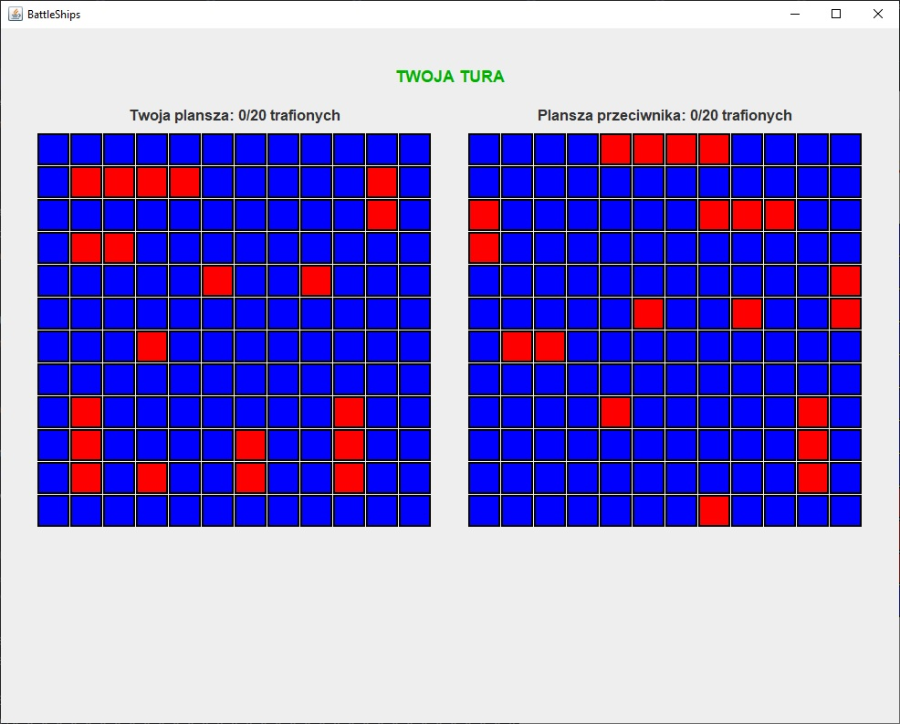

Readme ENG -> [link](README.md)

# Battleships – Klasyczna gra w statki (TCP Multiplayer)

Projekt klasycznej gry w statki (1 vs 1) z graficznym interfejsem użytkownika (Swing) oraz komunikacją sieciową opartą o sockety TCP. Aplikacja działa w architekturze zbliżonej do MVC i pozwala na grę przez sieć lokalną. Początkowo był to prosty projekt na studia, ale rozwinąłem go na tyle, że stał się czymś, z czego jestem naprawdę dumny.

## Instalacja i uruchomienie

Wymagania:
- Java 22+
- Maven

Budowanie projektu:
```bash
mvn clean package
```

Uruchomienie gry:
```bash
java -jar target/battleships-1.0-SNAPSHOT.jar
```
lub w trybie testowym:
```bash
java -jar target/battleships-1.0-SNAPSHOT.jar --test
```

## Jak grać?

Gra składa się z czterech ekranów:
1. **Menu główne** – wybór trybu (hostowanie gry lub dołączenie do serwera).
2. **Ustawianie statków** – ustaw statki klikając na planszę i podaj swój nick.
3. **Rozgrywka** – gracze na przemian oddają strzały w planszę przeciwnika:
   - Grę rozpoczyna gracz-host.
   - Jeśli trafisz, kontynuujesz swoją turę.
4. **Podsumowanie** – ekran końcowy ze statystykami po zakończonej grze.

<p align="center">
  
  
</p>
<p align="center">
  
  
</p>

Tryb testowy:
Po uruchomieniu z flagą `--test`, menu zawiera opcje:
- automatycznego ustawienia statków,
- podglądu statków na planszy przeciwnika.

## Technologie

Projekt został zaprojektowany z podejściem zbliżonym do wzorca MVC:
- **Model** Klasy reprezentujące stan gry: plansze, statystyki, dane graczy, typy enumeratywne.
- **View** Komponenty Swing do obsługi GUI – panele ekranów i plansze.
- **Controller** Logika sterująca (GameController), komunikacja sieciowa (SocketNetworkHandler) oraz silnik gry (GameEngine).
- Komunikacja między komponentami aplikacji została rozwiązana m.in. dzięki wykorzystaniu interfejsów funkcjonalnych (Java 8+).

## Najważniejsze klasy

- `Main.java`, `Battleships.java` – punkt startowy aplikacji.
- `GameController.java` – odpowiada za zarządzanie przepływem gry: obsługuje kliknięcia użytkownika, połączenie sieciowe (klient/serwer), przełączanie ekranów, synchronizację tur oraz aktualizację stanu gry we współpracy z `GameEngine` i `SocketNetworkHandler`.
- `GameEngine.java` – lokalna logika gry, obsługuje strzały, zarządzanie planszami gracza i przeciwnika, sprawdzanie warunków zakończenia gry oraz kontrolę tury.
- `SocketNetworkHandler.java` – Interfejs odpowiadający za komunikację przez TCP.
- `AppFrame.java` – główna ramka GUI.
- `MainMenuPanel`, `ShipsSetupPanel`, `GameViewPanel`, `SummaryPanel` – poszczególne widoki gry.

## To do

- dodanie języka angielskiego do UI,
- walidacja ustawienia statków (np. brak stykania się, wymagane rozmiary),
- ustawianie statków metodą Drag&Drop,
- tryb Singleplayer z AI.

⭐ Jeśli repozytorium okazało się przydatne, zostaw gwiazdkę!
